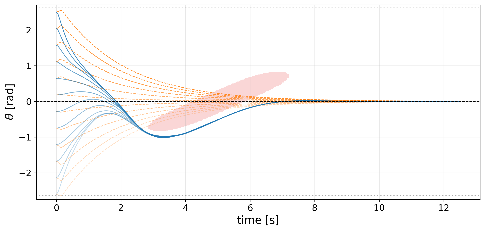
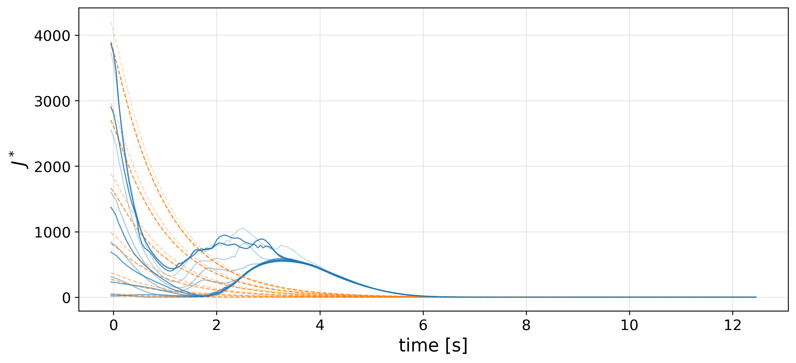

# Learning-Based Control via Predictive Safety Filters

This repository contains the code used to generate the numerical example in the paper  
**"Safety-Aware Performance Boosting for Constrained Nonlinear Systems"**

The experiment is an inverted pendulum with:
- hard state and input constraints,
- a moving obstacle that must be avoided,
- a **Predictive Safety Filter (PSF)** that guarantees safety and convergence,
- a learned **performance-boosting policy** (the "actor") that tries to improve performance while remaining safe.

**Key idea:**
- The learned policy does **not** directly control the plant.
- Instead, it proposes  
  1. a desired input \(u_L\), and  
  2. a scheduling knob \(\rho_t\) that sets how aggressively the PSF enforces Lyapunov decrease.
- The PSF takes these proposals, solves a short-horizon constrained optimal control problem, and returns a **safe input** that can actually be applied.
- This guarantees stability and constraint satisfaction at all times, even while learning.

This repository reproduces:
- closed-loop trajectories,
- the paper plots (pendulum angle vs. time, cost \(J^\star\)),

<p align="center">
  
</p>
<p align="center">
  
</p>

- an animation of the pendulum avoiding the obstacle.

<p align="center">
  
</p>

---

## Table of Contents
1. [Repository Structure](#repository-structure)  
2. [Quickstart: Train and Log a Run](#quickstart-train-and-log-a-run)  
3. [Generate the Paper Figures](#generate-the-paper-figures)  
4. [Generate the Pendulum GIF](#generate-the-pendulum-gif)  
5. [Citation](#citation)  
6. [License](#license)

---

## Repository Structure

```text
.
├── run.py
├── plot_results.py
├── create_gifs.py
├── pendulum_env.py
├── single_pendulum_sys.py
├── mad_controller.py
├── PSF.py
├── obstacles.py
├── loss_function.py
├── plot_functions.py
├── results/
│   ├── <RUN_FOLDER_NAME>/
│   │   ├── training.log
│   │   ├── model_best.pth
│   │   ├── model_latest.pth
│   │   ├── rollout_*.npz        # logged trajectories, costs, etc.
│   ├── plots/
│   │   ├── theta_closed_loop.pdf
│   │   ├── cost_J.pdf
│   └── gifs/
│       ├── pendulum_single.gif
└── figures/
    ├── theta_closed_loop.pdf    # copy from results/plots/
    ├── cost_J.pdf               # copy from results/plots/
    ├── pendulum.gif             # copy from results/gifs/
```

---

## Quickstart: Train and Log a Run

1. (Optional but recommended) Create and activate a Python virtual environment and install the dependencies required by `run.py` (PyTorch, NumPy/SciPy, Matplotlib, CasADi, etc.).

2. From the project root, run:
```bash
python run.py
```

3. This will:
- train the learning-based controller in closed loop with the Predictive Safety Filter,
- create a timestamped folder under `results/`,
- save logs, rollouts (`rollout_*.npz`), and model checkpoints (`model_best.pth`, `model_latest.pth`).

The created directory under `results/` is referred to below as `RUN_FOLDER_NAME`.

---

## Generate the Paper Figures

After you have a trained run in `results/<RUN_FOLDER_NAME>/`, you can recreate the figures used in the paper.

1. Open `plot_results.py` and set:
```python
RUN_FOLDER_NAME   = "PSF_SSM_NS_..."   # the folder created by run.py
THETA0            = ...               # initial angle for evaluation
LEARNED_RHO_MODE  = "scheduled"       # or "fixed"
RHO_FIXED         = 0.5               # baseline PSF convergence rate
```

2. Run:
```bash
python plot_results.py
```

3. The script will:
- rebuild the **baseline PSF-only controller** (fixed ρ),
- rebuild the **learned controller + PSF** (scheduled ρ),
- simulate both from the same initial condition,
- save publication-style figures to:
```text
results/plots/theta_closed_loop.pdf
results/plots/cost_J.pdf
```

4. Copy them into the `figures/` folder:
```bash
cp results/plots/theta_closed_loop.pdf figures/
cp results/plots/cost_J.pdf figures/
```

- `theta_closed_loop.pdf` shows the closed-loop pendulum angle \(\tilde\theta(t)\) with the obstacle’s “forbidden band”.
- `cost_J.pdf` shows the evolution of a Lyapunov-like cost/value \(J^\star\), where the learned controller may temporarily increase the cost to safely route around the obstacle and then still converge.

---

## Generate the Pendulum GIF

You can also generate an animation of the pendulum avoiding the moving obstacle.

1. Open `create_gifs.py` and set:
```python
RUN_FOLDER_NAME   = "PSF_SSM_NS_..."   # same trained run
THETA0            = ...               # initial angle to visualize
LEARNED_RHO_MODE  = "scheduled"
RHO_FIXED         = 0.5
```

2. Run:
```bash
python create_gifs.py
```

3. The script will simulate one rollout of the learned controller + PSF and save:
```text
results/gifs/pendulum_single.gif
```

4. Copy it into `figures/`:
```bash
cp results/gifs/pendulum_single.gif figures/pendulum.gif
```

This GIF is the one embedded at the top of the README.

---

## Citation

If you use this repository in academic work, please cite:

```bibtex
@article{psf_learning_control_2025,
  title   = {Safety-Aware Performance Boosting for Constrained Nonlinear Systems},
  author  = {Danilo Saccani, Haoming Shen, Luca Furieri, Giancarlo Ferrari-Trecate},
  year    = {2025},
  note    = {Preprint available at arXiv: - coming soon -}
}
```

Preprint / arXiv: (link coming soon)

---

## License

This project is released under the Creative Commons Attribution 4.0 International (CC BY 4.0) license.

You are free to:
- share (copy and redistribute the material),
- adapt (remix, transform, build upon the material for any purpose, even commercially),

as long as you give appropriate credit.

The full license text is provided in [`LICENSE.md`](LICENSE.md).
